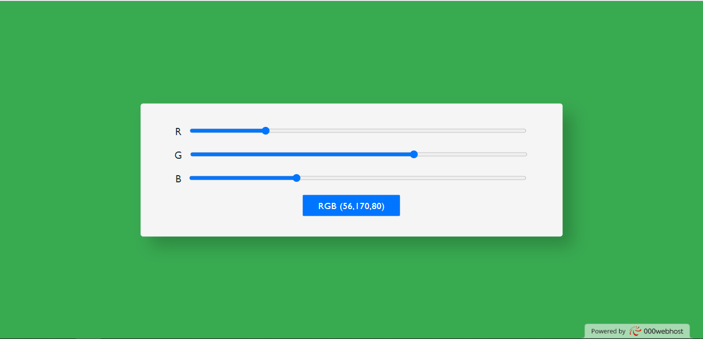
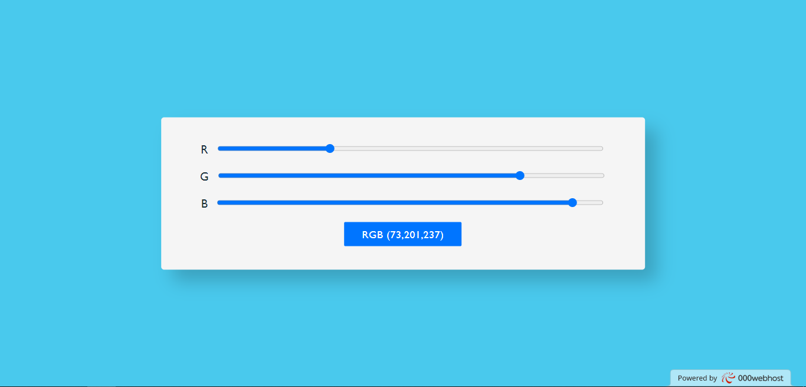
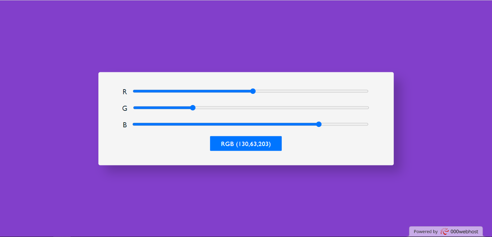

# RGB Slider in JavaScript

This is a simple RGB Color Slider project built using HTML, CSS, and JavaScript. The project allows users to adjust the red, green, and blue color channels using range sliders, and it dynamically updates the background color of the page based on the selected RGB values.

## Demo

Check out the live demo of the RGB Slider: [Live Demo](https://calnum.000webhostapp.com/RGB%20Color%20Slider/index.html)

## Getting Started

To get a local copy of this project up and running, follow these steps:

1. Clone this repository: `git clone https://github.com/awais-akhter/RGB-Slider-in-JS.git`
2. Navigate to the project directory: `cd RGB-Slider-in-JS`
3. Open `index.html` in your preferred web browser.

## How to Use

1. Open the RGB Slider in your web browser.
2. Adjust the range sliders for the red, green, and blue color channels to set your desired color.
3. As you move the sliders, the background color of the page will update in real-time.
4. The current RGB values will be displayed below the sliders.

## Screenshots

## Contributing

Contributions are welcome! If you have any improvements or feature suggestions, feel free to submit a pull request. Please make sure to follow the code of conduct.

## License

This project is licensed under the [MIT License](LICENSE).

## Contact

If you have any questions, suggestions, or just want to say hello, feel free to reach out to the project maintainer at [awaisakhter@pm.me](mailto:awaisakhter@pm.me).

Let your creativity flow and have fun exploring the colorful world of the RGB Slider!
